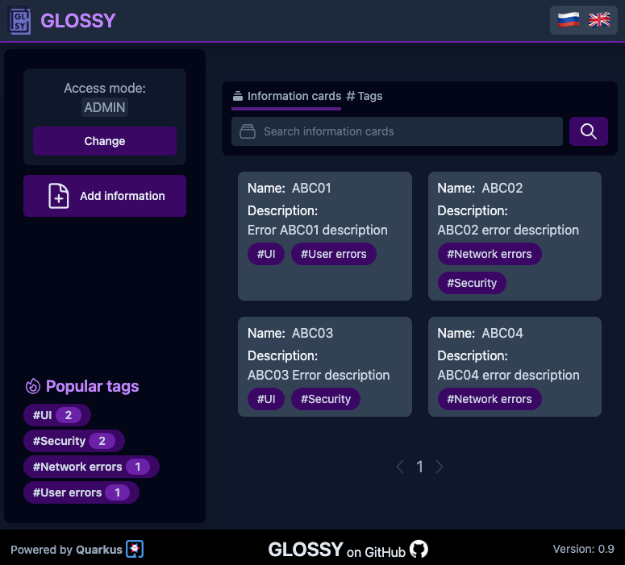

# Glossy

Self-hosted performant and low-resource required glossary service powered by [Quarkus](https://github.com/quarkusio).

<kbd>   [README (EN)][Link_readme_en]   </kbd>
<kbd>   [README (RU)][Link_readme_ru]   </kbd>

[Link_readme_en]: docs/en/README.md 'Open README'
[Link_readme_ru]: docs/ru/README.md 'Открыть README'

